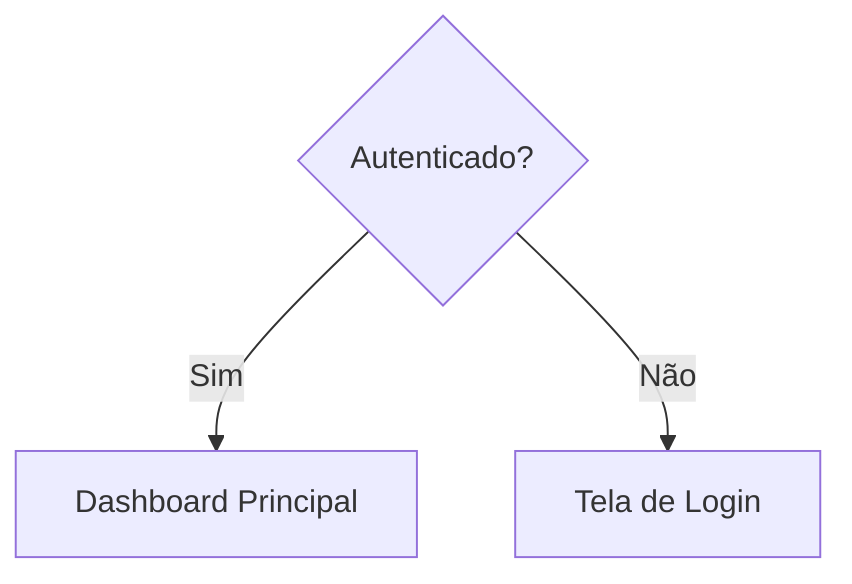
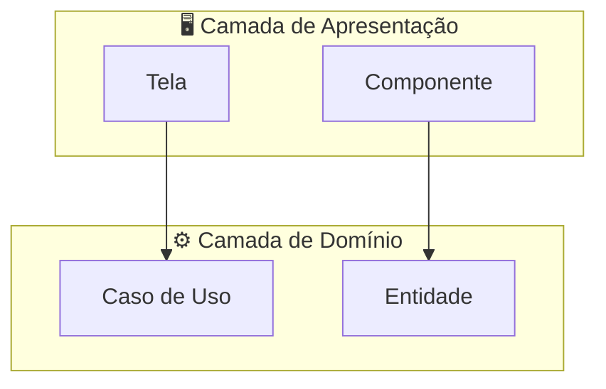
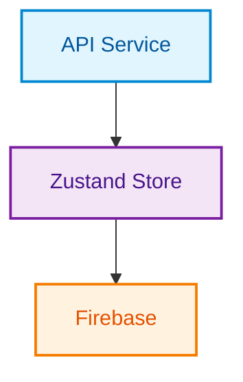
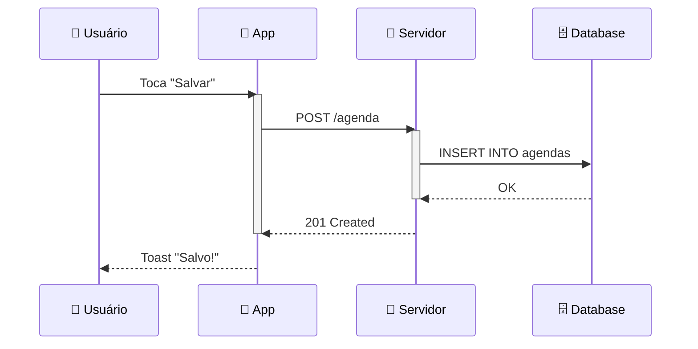
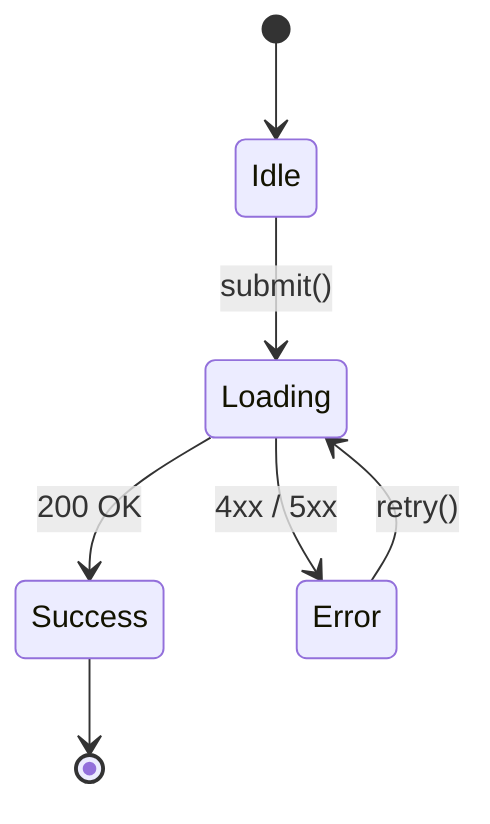
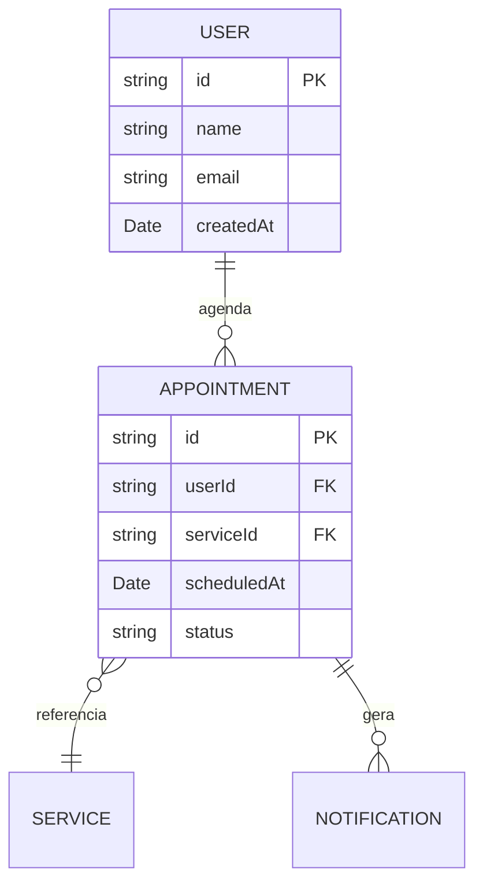
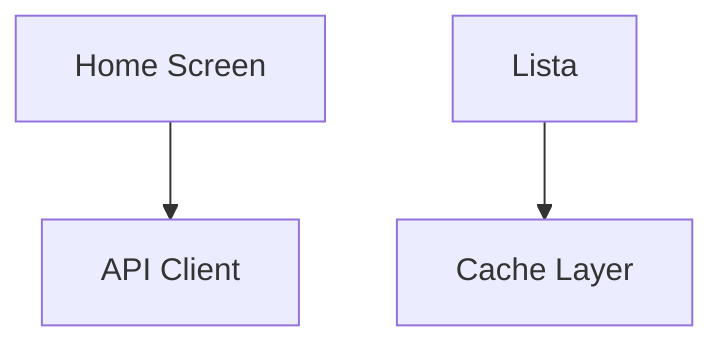

# Mermaid Diagrams — Guia de Boas Práticas

> Referência para criação de diagramas técnicos com alta legibilidade, manutenibilidade e aceitação em equipes de engenharia de software.

---

## 1. Princípios Fundamentais

### 1.1 Um diagrama, uma responsabilidade

Cada diagrama deve responder **uma única pergunta**. Se o diagrama tenta mostrar arquitetura de dados, fluxo de navegação e estados ao mesmo tempo, ele falha em comunicar qualquer um desses conceitos com clareza.

| Pergunta | Tipo de diagrama |
|---|---|
| "Como os dados fluem?" | `graph TD` / `flowchart` |
| "Quem fala com quem e em que ordem?" | `sequenceDiagram` |
| "Quais são os estados possíveis?" | `stateDiagram-v2` |
| "Como as entidades se relacionam?" | `erDiagram` |
| "Qual a linha do tempo do projeto?" | `gantt` |
| "Qual a hierarquia de classes?" | `classDiagram` |

### 1.2 Regra dos 7 ± 2

Baseado no princípio de Miller sobre carga cognitiva, cada diagrama deve conter entre **5 e 9 nós visíveis** no nível principal. Se ultrapassar esse número, divida em subdiagramas ou use `subgraph` para agrupar.

### 1.3 Leitura em "F" ou "Z"

O olho humano percorre conteúdo técnico em padrão F (vertical) ou Z (horizontal). Organize os diagramas para que:

- `graph TD` (top-down): O fluxo principal segue de cima para baixo, decisões à direita.
- `graph LR` (left-right): A hierarquia avança da esquerda para a direita, como leitura natural.

---

## 2. Nomenclatura e IDs

### 2.1 IDs semânticos e consistentes

IDs de nós devem ser curtos, descritivos e seguir um padrão uniforme. Evite IDs genéricos como `A`, `B`, `C`.

```
❌ Ruim
A[Tela Home] --> B[Lista]
B --> C[Detalhes]

✅ Bom
HOME[Tela Home] --> LIST[Lista de Itens]
LIST --> DETAIL[Detalhes do Item]
```

**Convenção recomendada:**

- Nós de componente: `UPPER_SNAKE_CASE` — `HOME_SCREEN`, `NAV_STACK`
- Nós de ação/evento: `camelCase` com prefixo verbal — `fetchData`, `onSubmit`
- Nós de decisão: sufixo `?` no label — `"Autenticado?"`

### 2.2 Labels entre colchetes com contexto

Sempre forneça labels descritivos. O label é o que o leitor vê; o ID é o que o código referencia.



---

## 3. Direção e Orientação

### 3.1 Escolha a direção pelo tipo de informação

| Direção | Melhor para | Exemplo |
|---|---|---|
| `TD` (top-down) | Fluxos de dados, pipelines, arquitetura em camadas | Arquitetura de dados |
| `LR` (left-right) | Hierarquias, árvores de componentes, timelines | Hierarquia de componentes |
| `BT` (bottom-up) | Dependências (o que depende do quê) | Gráficos de dependência |
| `RL` (right-left) | Raro, mas útil para fluxos de resposta | Fluxo de retorno de dados |

### 3.2 Não misture direções no mesmo diagrama

Cada `graph` deve ter uma única direção. Se precisar de fluxos em múltiplas direções, use `subgraph` com layouts implícitos.

---

## 4. Subgraphs — Agrupamento Visual

### 4.1 Quando usar subgraph

Use subgraphs para representar:

- **Camadas arquiteturais**: Apresentação, Domínio, Infraestrutura
- **Módulos/features**: Autenticação, Agendamento, Notificações
- **Responsabilidade**: Frontend, Backend, Serviços externos



### 4.2 Regras para subgraphs limpos

- Limite a **3-4 subgraphs** por diagrama.
- Nomeie subgraphs com labels descritivos entre aspas.
- Use emojis com moderação como prefixos visuais para diferenciação rápida.
- Subgraphs não devem ter mais de 5-6 nós internos.

---

## 5. Estilização e Theming

### 5.1 Use `classDef` para categorias visuais

Defina classes de estilo para categorizar nós por tipo, e não por instância. Isso mantém o diagrama legível quando renderizado em temas claro e escuro.



### 5.2 Paleta de cores recomendada

Para compatibilidade com temas claro/escuro e acessibilidade (WCAG AA):

| Categoria | Fill | Stroke | Uso |
|---|---|---|---|
| Primário / Serviço | `#e1f5fe` | `#0288d1` | Services, APIs |
| Secundário / Store | `#f3e5f5` | `#7b1fa2` | Estado, stores |
| Externo / 3rd party | `#fff3e0` | `#f57c00` | Serviços externos |
| Sucesso / Ativo | `#e8f5e9` | `#388e3c` | Estados ativos |
| Erro / Alerta | `#ffebee` | `#d32f2f` | Erros, falhas |
| Neutro | `#f5f5f5` | `#9e9e9e` | Nós auxiliares |

### 5.3 Contraste e legibilidade

- Sempre defina `color` (cor do texto) junto com `fill` para garantir contraste.
- Evite `fill` muito saturados — tons pastéis funcionam melhor.
- Stroke-width de `2px` é o padrão ideal para diferenciação sem poluição visual.

---

## 6. Boas Práticas por Tipo de Diagrama

### 6.1 Flowchart / Graph

```
✅ Boas práticas:
- Use losangos {} para decisões
- Use retângulos [] para processos
- Use retângulos arredondados () para início/fim
- Use paralelograma [/ /] para entrada/saída
- Limite a 3 níveis de profundidade

❌ Evite:
- Mais de 2 saídas por nó de decisão
- Conexões cruzadas que geram "spaghetti"
- Nós sem conexão (órfãos)
```

### 6.2 Sequence Diagram

```
✅ Boas práticas:
- Ordene participantes da esquerda para direita pela frequência de interação
- Use `activate` / `deactivate` para mostrar tempo de processamento
- Agrupe fluxos relacionados com `rect` (background highlight)
- Use `alt` / `else` para caminhos condicionais
- Use `note over` para comentários contextuais

❌ Evite:
- Mais de 6 participantes (divida em diagramas separados)
- Mensagens de retorno sem label
- Sequências com mais de 15 interações
```



### 6.3 State Diagram

```
✅ Boas práticas:
- Sempre defina [*] como estado inicial
- Agrupe estados relacionados com `state "nome" as alias`
- Transições devem ter labels descrevendo o evento/gatilho
- Limite a 8 estados por diagrama
- Use composite states para máquinas complexas

❌ Evite:
- Estados sem transição de saída (deadlocks)
- Transições sem label (o leitor não sabe o que causa a mudança)
- Mais de 3 transições saindo do mesmo estado
```



### 6.4 ER Diagram

```
✅ Boas práticas:
- Use os quatro tipos de cardinalidade: ||--o{, ||--|{, }o--o{, ||--||
- Nomes de entidades em PascalCase
- Atributos com tipo explícito (string, number, Date, boolean)
- Marque chaves primárias com PK e foreign keys com FK
- Agrupe entidades relacionadas próximas no código

❌ Evite:
- Mais de 10 entidades por diagrama
- Atributos sem tipo
- Relacionamentos sem label descritivo
```



---

## 7. Organização do Código Mermaid

### 7.1 Estrutura recomendada do bloco

Organize cada bloco Mermaid na seguinte ordem:

```
1. Declaração do tipo e direção
2. classDef (estilos)
3. Definição de nós
4. Subgraphs
5. Conexões entre nós
6. Aplicação de classes (:::)
```

### 7.2 Comentários com `%%`

Use comentários para separar seções lógicas do diagrama:



### 7.3 Um arquivo, múltiplos diagramas

Quando colocar múltiplos diagramas em um mesmo `.md`:

- Separe cada diagrama com um heading `##` descritivo.
- Adicione um parágrafo de contexto antes de cada diagrama explicando **o que** o diagrama responde.
- Numere os diagramas para referência cruzada.
- Inclua um índice no topo do arquivo.

---

## 8. Performance e Renderização

### 8.1 Limites práticos de renderização

| Métrica | Limite recomendado | Limite máximo |
|---|---|---|
| Nós por diagrama | 15 | 30 |
| Conexões por diagrama | 20 | 50 |
| Subgraphs | 4 | 6 |
| Participantes (sequence) | 5 | 8 |
| Estados (stateDiagram) | 8 | 12 |
| Entidades (ER) | 8 | 12 |

### 8.2 Diagramas que não renderizam bem

Se o diagrama ultrapassar os limites, considere:

- Dividir em diagramas de "zoom": um overview e múltiplos detalhamentos.
- Usar `click` para links entre diagramas em documentação interativa.
- Criar um índice visual que mapeia qual diagrama detalha qual área.

---

## 9. Documentação e Contexto

### 9.1 Template para cada diagrama

Todo diagrama em documentação técnica deve seguir este template:

```markdown
## [Número]. [Nome do Diagrama]

**Pergunta que responde:** [O que este diagrama comunica?]

**Público-alvo:** [Devs frontend? Backend? Stakeholders?]

**Última atualização:** [Data]

[bloco mermaid]

**Legenda:**
- 🔵 Azul: Serviços internos
- 🟣 Roxo: Estado/stores
- 🟠 Laranja: Serviços externos

**Notas:**
- [Decisão arquitetural relevante]
- [Limitação conhecida]
```

### 9.2 Versionamento

- Diagramas devem ser versionados junto com o código no mesmo repositório.
- Use diffs de texto no PR para revisar mudanças nos diagramas.
- Considere gerar imagens `.svg` ou `.png` no CI para documentação estática.

---

## 10. Checklist Final de Qualidade

Antes de considerar um diagrama pronto, valide cada item:

- [ ] O diagrama responde **uma única pergunta** claramente?
- [ ] Tem no máximo **9 nós** no nível principal?
- [ ] Os IDs são **semânticos** e seguem convenção consistente?
- [ ] Todos os nós têm **labels descritivos**?
- [ ] A direção (`TD`/`LR`) é adequada ao tipo de informação?
- [ ] Os estilos (`classDef`) usam cores com **contraste acessível**?
- [ ] Subgraphs agrupam por **responsabilidade**, não por conveniência?
- [ ] Todas as transições/conexões têm **labels** quando necessário?
- [ ] O diagrama **renderiza corretamente** em preview?
- [ ] Há um **parágrafo de contexto** antes do diagrama?
- [ ] A **legenda** explica as categorias visuais?
- [ ] O diagrama está dentro dos **limites de renderização**?

---

## 11. Ferramentas de Apoio

| Ferramenta | Uso |
|---|---|
| [Mermaid Live Editor](https://mermaid.live) | Preview e debug em tempo real |
| [Mermaid CLI](https://github.com/mermaid-js/mermaid-cli) | Geração de SVG/PNG no CI |
| VS Code + extensão Mermaid | Preview integrado no editor |
| GitHub / GitLab | Renderização nativa em arquivos `.md` |

---

## 12. Antipatterns Comuns

### 12.1 O "Diagrama de Tudo"
Um único diagrama tentando mostrar arquitetura, fluxo de dados, estados e relacionamentos. Solução: divida em diagramas especializados.

### 12.2 O "Spaghetti Diagram"
Excesso de conexões cruzadas que tornam o diagrama ilegível. Solução: reorganize nós para minimizar cruzamentos, ou divida em camadas.

### 12.3 O "Diagrama Fantasma"
Diagrama criado uma vez e nunca atualizado, mostrando uma arquitetura que não existe mais. Solução: vincule diagramas a PRs e revise junto com o código.

### 12.4 O "Diagrama Estético"
Diagrama bonito mas que não comunica nada útil. Solução: todo diagrama deve começar com a pergunta que responde.

### 12.5 O "Diagrama sem Legenda"
Cores e formas diferentes sem explicação. Solução: toda diferenciação visual precisa de uma legenda explícita.

---

> **Referência rápida:** Ao criar seus 7 diagramas de arquitetura, aplique este guia como checklist em cada um. Comece pela pergunta que o diagrama responde, valide os limites de complexidade, e garanta que a estilização é consistente entre todos os diagramas do mesmo documento.
