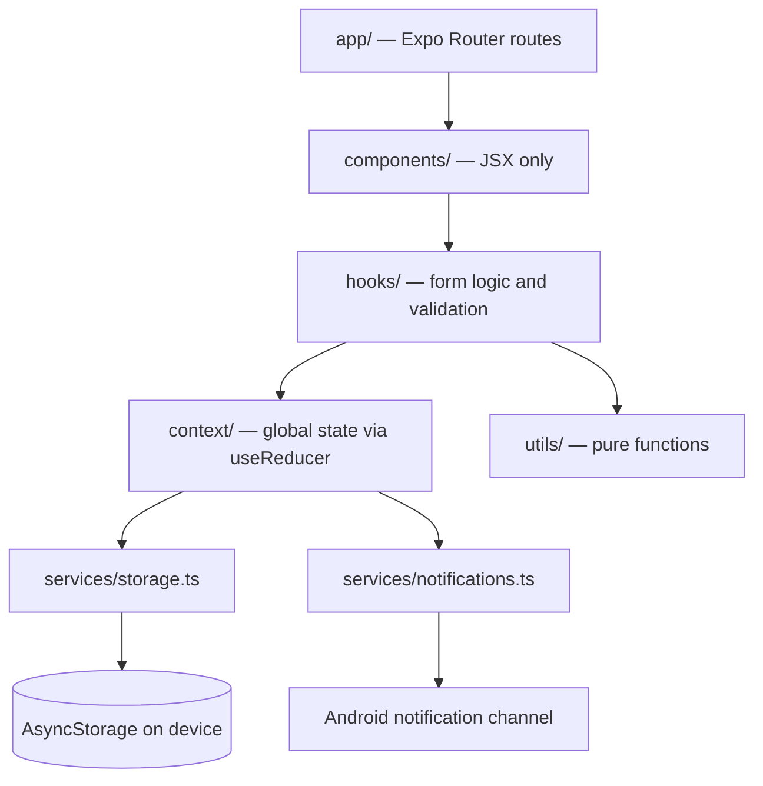

# Repertório Progressivo

Android app for planning study reminders and tracking monthly and yearly study progress.

[](https://github.com/tavinholoco/repertorio-progressivo/actions/workflows/test.yml)     

**English** | [Português](README.pt-BR.md)

## Quick links

- [Download the latest APK](https://github.com/tavinholoco/repertorio-progressivo/releases/latest) — Android, sideload install
- [Architecture documentation](docs/architecture.md) — 8 Mermaid diagrams
- [Releases](https://github.com/tavinholoco/repertorio-progressivo/releases) — notes per version

## Table of contents

- [Screenshots](#screenshots)
- [About](#about)
- [Features](#features)
- [Tech stack](#tech-stack)
- [Architecture](#architecture)
- [Project structure](#project-structure)
- [Getting started](#getting-started)
- [Scripts](#scripts)
- [Tests](#tests)
- [Deploy](#deploy)
- [License](#license)
- [Author](#author)

## Screenshots

### Agenda tab

<div align="center">

| Reminder form | Custom color picker | Calendar and saved reminders |
|:---:|:---:|:---:|
|  |  |  |

</div>

### Aproveitamento tab

<div align="center">

| Monthly mode | Yearly mode | Saved records |
|:---:|:---:|:---:|
|  |  |  |

</div>

<details>
<summary>Version 1.0 screenshots</summary>

<div align="center">

| Agenda form (v1) | Agenda calendar (v1) |
|:---:|:---:|
|  |  |

| Aproveitamento form (v1) | Period selector (v1) | Saved records (v1) |
|:---:|:---:|:---:|
|  |  |  |

</div>

</details>

## About

Keeping a study routine falls apart in two places: forgetting when to study, and losing track of whether you actually studied. Generic to-do apps solve the first and ignore the second. Spreadsheets do the opposite.

Repertório Progressivo puts both in one app, split across two tabs. **Agenda** holds scheduled reminders with a date, a time and a priority, backed by real Android notifications. **Aproveitamento** tracks execution: you register a study event with its total workload, then tick off the days you actually studied, monthly or across a full year, and watch the progress bar move.

Everything runs offline. There is no account, no server and no network call — records live in AsyncStorage on the device, and notifications are scheduled by the OS.

The app was also built as an exercise in layered architecture on React Native. Business logic sits in hooks and contexts, disk access is isolated behind a single service, and screens are JSX only. That separation is what makes 144 automated tests possible in a mobile project without putting an emulator in the loop.

## Features

**Reminders (Agenda)**

- Create reminders with name, date, time and priority: low, medium, high, or a custom color
- Chromatic color picker for custom priorities, presented in a blurred modal
- Month calendar marking every day that has a reminder
- Scheduled Android notifications, cancelled automatically when a reminder is deleted
- Edit and delete existing reminders

**Study tracking (Aproveitamento)**

- Register study events with a total workload in hours
- Monthly mode: a grid with the real number of days in the month, tick the days you studied
- Yearly mode: 12 independent months, each with completed days out of its own real total
- Animated progress bar computed from the ticked days or months
- Navigate to previous and next periods, loading the matching record automatically

**Interface**

- Custom floating tab bar with SVG icons and a linear gradient on the active tab
- Text inputs with an animated focus border
- Empty states with icon and guidance when a list has no items
- Haptic feedback on selection and on save
- Unified theme tokens for color, spacing and typography

## Tech stack

| Layer | Technologies |
| --- | --- |
| App | React Native 0.81.5, React 19.1.0, Expo SDK 54.0.23, expo-router 6.0.14 (file-based routing) |
| Language | TypeScript 5.9.3 in strict mode |
| UI | NativeWind 2.0.11 (Tailwind CSS 3.3.2), react-native-reanimated 4.1.5, react-native-svg 15.15.3, expo-linear-gradient 15.0.8, reanimated-color-picker 4.2.0, react-native-calendars 1.1313.0, Inter via @expo-google-fonts |
| Storage | AsyncStorage 2.2.0 |
| Notifications | expo-notifications 0.32.16 |
| Quality | Jest 30.2.0, jest-expo 54.0.17, @testing-library/react-native 13.3.3, ESLint 9 with eslint-config-expo |
| Build | Expo Prebuild with Gradle, EAS Build, GitHub Actions |

The New Architecture (Fabric and TurboModules) is enabled through `newArchEnabled: true`, and the React Compiler through `experiments.reactCompiler: true`, both in `app.json`. Since the compiler handles memoization, `useMemo` and `useCallback` are not written by hand anywhere in the codebase.

## Architecture



Data flows in one direction. A screen renders what a hook gives it, the hook validates input and calls a context, the context reduces state and delegates every side effect to a service. Two rules keep the layers from leaking: no component ever touches `AsyncStorage` directly, and no component calls `useContext` directly — always the `useReminders()` and `useAproveitamento()` hooks.

Every directory exposes an `index.ts` barrel, so code outside a directory imports from `@/components`, `@/hooks`, `@/utils` and `@/constants`. Code inside a directory imports its siblings directly with `./Foo`, never through the barrel, which would create a require cycle.

Reducers are exported separately from their providers, which is what allows them to be unit tested as pure functions. In `RemindersContext`, the record is persisted before the notification is scheduled and then saved again with the returned `notificationId`. That ordering is asserted by a test, so the race condition cannot come back.

[`docs/architecture.md`](docs/architecture.md) holds 8 Mermaid diagrams covering the data flow, the component tree, the notification sequence, both form state machines, the reducer actions of each context, and the ER diagram of the shared types.

## Project structure

```
.
├── app/                  Expo Router routes: _layout, index (Agenda), Aproveitamento
├── components/           UI components, JSX only, plus ErrorBoundary and FloatingTabBar
├── hooks/                useAgendaForm, useAproveitamentoForm — all form logic
├── context/              RemindersContext, AproveitamentoContext — useReducer state
├── services/             storage.ts (sole AsyncStorage owner), notifications.ts
├── utils/                dateHelpers, validation, id — pure functions
├── constants/            theme.ts — AppColors, Layout, FontFamily, calendarTheme
├── types/                Shared TypeScript interfaces
├── __tests__/            Jest suites, mirroring the source folders
├── docs/                 architecture.md and screenshots
└── android/              Native project generated by Expo Prebuild
```

## Getting started

### Prerequisites

- Node.js 20 or newer — the CI pipeline runs on Node 20
- Git
- Android Studio with the Android SDK
- An Android emulator configured in AVD Manager, or a physical device with USB debugging

A separate JDK install is not needed: Android Studio ships one at `jbr`.

### Installation

```bash
git clone https://github.com/tavinholoco/repertorio-progressivo.git
cd repertorio-progressivo
npm install
```

Use `npx expo install <package>` rather than `npm install <package>` when adding dependencies. Expo pins versions validated against SDK 54.

### Required manual configuration

The app uses no environment variables and has no `.env` file. It does need one machine-specific Gradle file, which is gitignored and must be created by hand.

Create `android/local.properties` pointing at your Android SDK:

```properties
sdk.dir=C\:\\Users\\<your-user>\\AppData\\Local\\Android\\Sdk
```

On Linux or macOS:

```properties
sdk.dir=/Users/<your-user>/Library/Android/sdk
```

`android/gradle.properties` is committed and already points Gradle at the Android Studio JDK:

```properties
org.gradle.java.home=C:\\Program Files\\Android\\Android Studio\\jbr
```

Adjust that line if Android Studio lives elsewhere on your machine, or remove it if your system `JAVA_HOME` already points at a valid JDK.

### Running

Build and install the native development app on a running emulator or a connected device:

```bash
npm run android
```

This is the required mode for testing notifications. `expo-notifications` has not worked in Expo Go since Expo SDK 53, so `npm start` runs the app but silently skips every notification.

## Scripts

| Script | Description |
| --- | --- |
| `npm run android` | Build the native app and run it on Android |
| `npm run ios` | Build the native app and run it on the iOS simulator |
| `npm start` | Start the Expo dev server for Expo Go, without notification support |
| `npm run web` | Start the app in the browser through React Native Web |
| `npm test` | Run the Jest suite |
| `npm run test:watch` | Run Jest in watch mode |
| `npm run lint` | Run ESLint through `expo lint` |
| `npm run reset-project` | Reset the project back to the create-expo-app boilerplate |

## Tests

144 tests across 8 suites, all passing. Six suites are unit tests over pure functions and mocked service boundaries. The other two are integration tests that mount the real providers with `renderHook` and assert the full orchestration, including the order in which storage and notifications are called.

| Suite | Type | Tests | Coverage |
| --- | --- | --- | --- |
| `utils/validation.test.ts` | Unit | 29 | `validateReminder`, `validateAproveitamento`, hex and whitespace edge cases |
| `utils/dateHelpers.test.ts` | Unit | 36 | Date and period helpers, including real month lengths and leap years |
| `services/storage.test.ts` | Unit | 13 | AsyncStorage layer: get, save and delete for reminders and records |
| `services/notifications.test.ts` | Unit | 11 | Scheduling and cancelling, with denied permission and past dates |
| `context/remindersReducer.test.ts` | Unit | 17 | Every reducer action plus the unknown-action default case |
| `context/aproveitamentoReducer.test.ts` | Unit | 18 | Same coverage for the Aproveitamento reducer |
| `context/remindersContext.test.ts` | Integration | 12 | `addReminder`, `updateReminder`, `removeReminder` end to end |
| `context/aproveitamentoContext.test.ts` | Integration | 8 | `addRecord`, `updateRecord`, `removeRecord` end to end |

```bash
npm test                                       # full suite
npm run test:watch                             # watch mode
npx jest __tests__/services/storage.test.ts    # a single suite
npx jest --testNamePattern="addReminder"       # by test name
npx tsc --noEmit                               # type check, no emit
```

## Deploy

The app ships as an Android APK attached to GitHub Releases. Builds come from EAS Build using the profiles in `eas.json`: `development` for a debuggable client, `preview-apk` for the release APK that gets published, and `production` for the store bundle with `autoIncrement` enabled.

Release builds run R8 minification and resource shrinking, strip `console.*` calls through the Metro minifier config, and split the AAB by language, density and ABI.

Continuous integration runs on GitHub Actions through [`.github/workflows/test.yml`](.github/workflows/test.yml), on every push to `dev` and every pull request into `master`. The job type checks with `tsc --noEmit`, lints, and runs the full Jest suite on Node 20.

Branches follow a two-track flow: `dev` takes all active work, `master` holds stable releases only. Work lands on `dev`, is verified by CI, merges into `master`, and is tagged for the release.

## License

Distributed under the MIT License. See [LICENSE](LICENSE) for details.

## Author

**Pedro Levi Dias** — Fullstack Developer

[GitHub](https://github.com/tavinholoco) · [LinkedIn](https://www.linkedin.com/in/pedro-levi-dias-96720126a/) · [Portfolio](https://portfolio-tau-five-f86nc5khr8.vercel.app/)
