# Repertório Progressivo

App Android para planejar lembretes de estudo e acompanhar o aproveitamento mensal e anual.

[](https://github.com/tavinholoco/repertorio-progressivo/actions/workflows/test.yml)     

[English](README.md) | **Português**

## Links rápidos

- [Baixar o APK mais recente](https://github.com/tavinholoco/repertorio-progressivo/releases/latest) — Android, instalação por sideload
- [Documentação de arquitetura](docs/architecture.md) — 8 diagramas Mermaid
- [Releases](https://github.com/tavinholoco/repertorio-progressivo/releases) — notas por versão

## Índice

- [Screenshots](#screenshots)
- [Sobre](#sobre)
- [Funcionalidades](#funcionalidades)
- [Stack](#stack)
- [Arquitetura](#arquitetura)
- [Estrutura do projeto](#estrutura-do-projeto)
- [Como rodar localmente](#como-rodar-localmente)
- [Scripts](#scripts)
- [Testes](#testes)
- [Deploy](#deploy)
- [Licença](#licença)
- [Autor](#autor)

## Screenshots

### Aba Agenda

<div align="center">

| Formulário de lembrete | Seletor de cor personalizada | Calendário e lembretes salvos |
|:---:|:---:|:---:|
| 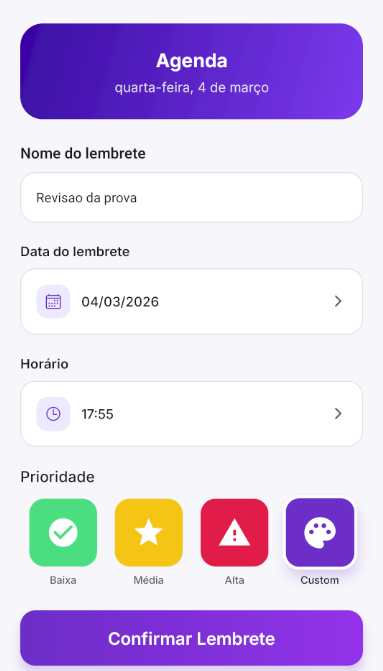 | 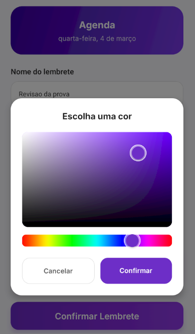 | 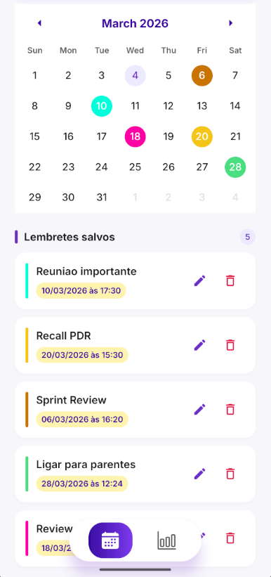 |

</div>

### Aba Aproveitamento

<div align="center">

| Modo mensal | Modo anual | Registros salvos |
|:---:|:---:|:---:|
| 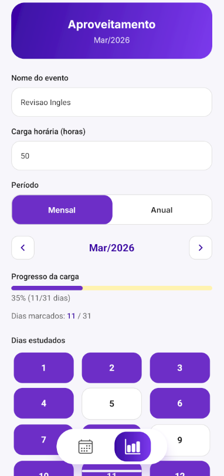 | 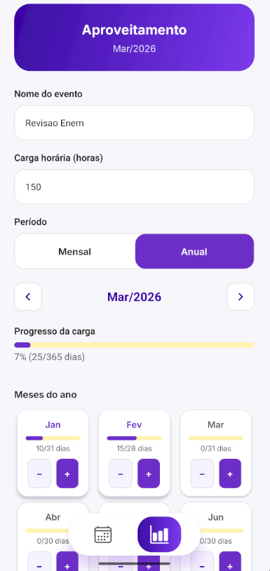 | 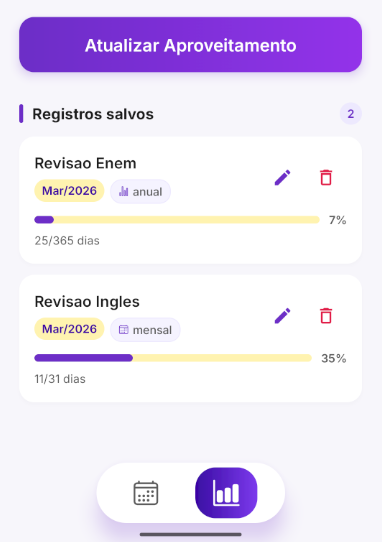 |

</div>

<details>
<summary>Screenshots da versão 1.0</summary>

<div align="center">

| Formulário da Agenda (v1) | Calendário da Agenda (v1) |
|:---:|:---:|
| 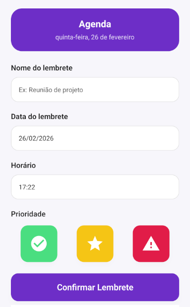 | 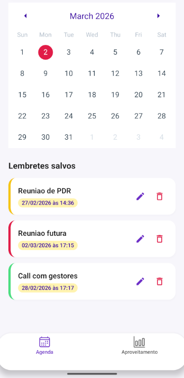 |

| Formulário de Aproveitamento (v1) | Seletor de período (v1) | Registros salvos (v1) |
|:---:|:---:|:---:|
| 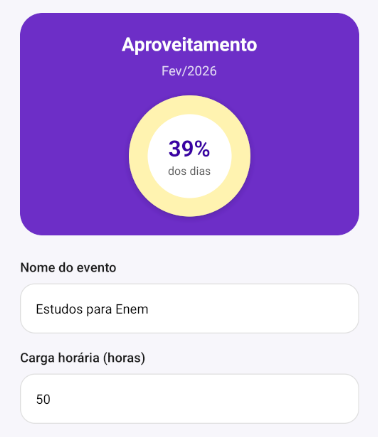 | 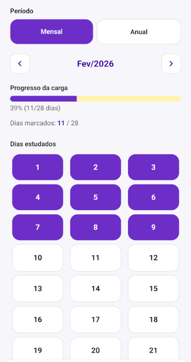 | 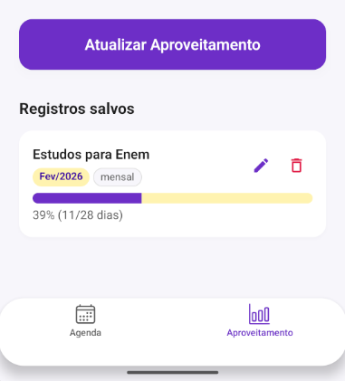 |

</div>

</details>

## Sobre

Manter uma rotina de estudos falha em dois pontos: esquecer quando estudar e perder a noção se você realmente estudou. Apps de tarefas genéricos resolvem o primeiro e ignoram o segundo. Planilhas fazem o contrário.

O Repertório Progressivo junta os dois em um app só, dividido em duas abas. A **Agenda** guarda lembretes com data, hora e prioridade, apoiados em notificações reais do Android. O **Aproveitamento** acompanha a execução: você registra um evento de estudo com a carga horária total, marca os dias em que de fato estudou — no mês ou no ano inteiro — e vê a barra de progresso andar.

Tudo roda offline. Não há conta, servidor nem chamada de rede: os registros ficam no AsyncStorage do aparelho e as notificações são agendadas pelo sistema operacional.

O app também foi construído como exercício de arquitetura em camadas no React Native. A lógica de negócio vive em hooks e contexts, o acesso a disco está isolado em um único serviço e as telas são apenas JSX. É essa separação que torna possível ter 144 testes automatizados em um projeto mobile sem depender de emulador.

## Funcionalidades

**Lembretes (Agenda)**

- Criar lembretes com nome, data, hora e prioridade: baixa, média, alta ou cor personalizada
- Seletor cromático de cor para prioridade personalizada, em modal com blur
- Calendário do mês marcando todos os dias que têm lembrete
- Notificações agendadas no Android, canceladas automaticamente ao excluir o lembrete
- Editar e excluir lembretes existentes

**Acompanhamento (Aproveitamento)**

- Registrar eventos de estudo com carga horária total
- Modo mensal: grid com o número real de dias do mês, marcando os dias estudados
- Modo anual: 12 meses independentes, cada um com dias concluídos sobre o seu total real
- Barra de progresso animada calculada a partir dos dias ou meses marcados
- Navegar entre períodos anteriores e posteriores, carregando o registro correspondente

**Interface**

- Tab bar flutuante customizada com ícones SVG e gradiente linear na aba ativa
- Campos de texto com borda animada no foco
- Empty states com ícone e orientação quando a lista está vazia
- Feedback háptico na seleção e ao salvar
- Tokens de tema unificados para cor, espaçamento e tipografia

## Stack

| Camada | Tecnologias |
| --- | --- |
| App | React Native 0.81.5, React 19.1.0, Expo SDK 54.0.23, expo-router 6.0.14 (roteamento por arquivos) |
| Linguagem | TypeScript 5.9.3 em strict mode |
| UI | NativeWind 2.0.11 (Tailwind CSS 3.3.2), react-native-reanimated 4.1.5, react-native-svg 15.15.3, expo-linear-gradient 15.0.8, reanimated-color-picker 4.2.0, react-native-calendars 1.1313.0, Inter via @expo-google-fonts |
| Persistência | AsyncStorage 2.2.0 |
| Notificações | expo-notifications 0.32.16 |
| Qualidade | Jest 30.2.0, jest-expo 54.0.17, @testing-library/react-native 13.3.3, ESLint 9 com eslint-config-expo |
| Build | Expo Prebuild com Gradle, EAS Build, GitHub Actions |

A New Architecture (Fabric e TurboModules) está habilitada via `newArchEnabled: true`, e o React Compiler via `experiments.reactCompiler: true`, ambos no `app.json`. Como o compilador cuida das memoizações, `useMemo` e `useCallback` não são escritos manualmente em nenhum ponto do código.

## Arquitetura

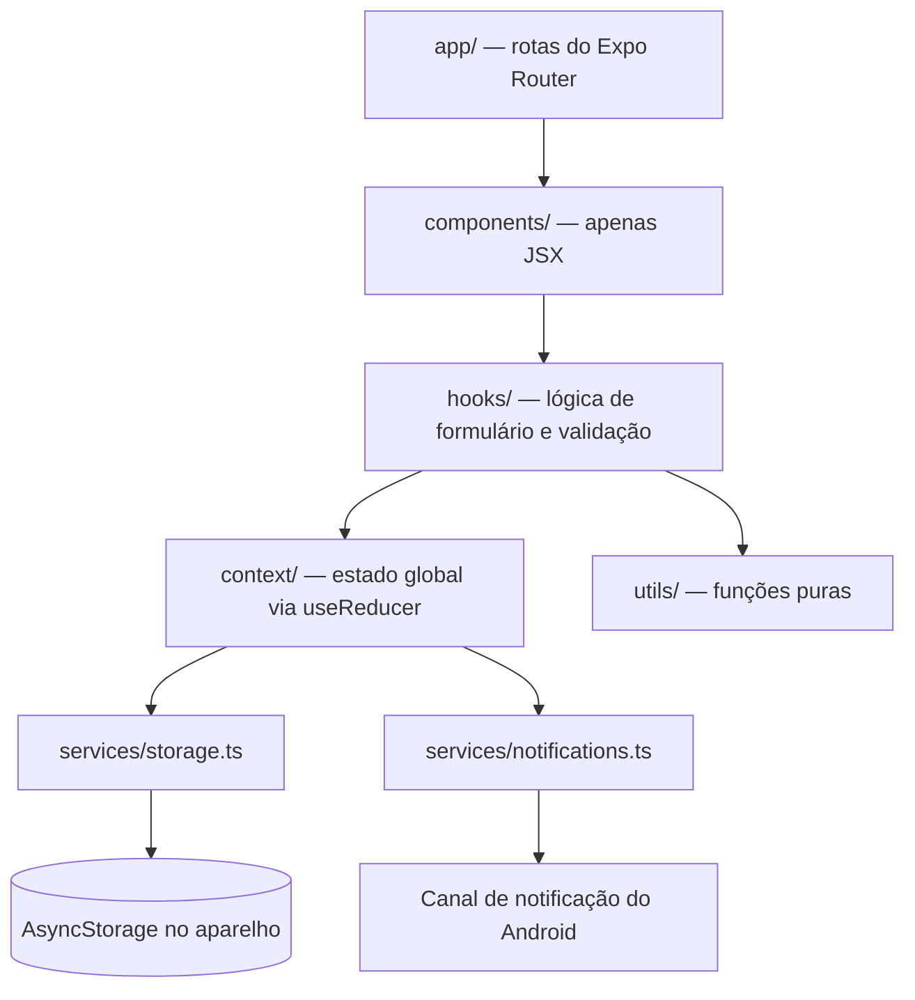

O fluxo de dados é unidirecional. A tela renderiza o que o hook entrega, o hook valida a entrada e chama o context, o context reduz o estado e delega todo efeito colateral para um serviço. Duas regras impedem o vazamento entre camadas: nenhum componente acessa o `AsyncStorage` diretamente e nenhum componente chama `useContext` diretamente — sempre pelos hooks `useReminders()` e `useAproveitamento()`.

Cada diretório expõe um barrel `index.ts`, então código fora do diretório importa de `@/components`, `@/hooks`, `@/utils` e `@/constants`. Código dentro do diretório importa os vizinhos diretamente com `./Foo`, nunca pelo próprio barrel, o que criaria um require cycle.

Os reducers são exportados separados dos providers, e é isso que permite testá-los como funções puras. No `RemindersContext`, o registro é persistido antes de a notificação ser agendada e salvo de novo com o `notificationId` retornado. Essa ordem é verificada por um teste, então a race condition não volta.

O arquivo [`docs/architecture.md`](docs/architecture.md) reúne 8 diagramas Mermaid cobrindo o fluxo de dados, a árvore de componentes, a sequência de notificações, as duas state machines de formulário, as ações do reducer de cada context e o diagrama ER dos tipos compartilhados.

## Estrutura do projeto

```
.
├── app/                  Rotas do Expo Router: _layout, index (Agenda), Aproveitamento
├── components/           Componentes de UI, apenas JSX, mais ErrorBoundary e FloatingTabBar
├── hooks/                useAgendaForm, useAproveitamentoForm — toda a lógica de formulário
├── context/              RemindersContext, AproveitamentoContext — estado via useReducer
├── services/             storage.ts (único dono do AsyncStorage), notifications.ts
├── utils/                dateHelpers, validation, id — funções puras
├── constants/            theme.ts — AppColors, Layout, FontFamily, calendarTheme
├── types/                Interfaces TypeScript compartilhadas
├── __tests__/            Suites Jest, espelhando as pastas de código
├── docs/                 architecture.md e screenshots
└── android/              Projeto nativo gerado pelo Expo Prebuild
```

## Como rodar localmente

### Pré-requisitos

- Node.js 20 ou superior — o pipeline de CI roda no Node 20
- Git
- Android Studio com o Android SDK
- Um emulador Android configurado no AVD Manager, ou um aparelho físico com depuração USB

Não é necessário instalar um JDK à parte: o Android Studio já inclui um em `jbr`.

### Instalação

```bash
git clone https://github.com/tavinholoco/repertorio-progressivo.git
cd repertorio-progressivo
npm install
```

Use `npx expo install <pacote>` em vez de `npm install <pacote>` ao adicionar dependências. O Expo fixa versões validadas para o SDK 54.

### Configuração manual obrigatória

O app não usa variáveis de ambiente e não tem arquivo `.env`. Ele precisa de um arquivo do Gradle específico da máquina, que está no `.gitignore` e deve ser criado à mão.

Crie `android/local.properties` apontando para o seu Android SDK:

```properties
sdk.dir=C\:\\Users\\<seu-usuario>\\AppData\\Local\\Android\\Sdk
```

No Linux ou macOS:

```properties
sdk.dir=/Users/<seu-usuario>/Library/Android/sdk
```

O `android/gradle.properties` está versionado e já aponta o Gradle para o JDK do Android Studio:

```properties
org.gradle.java.home=C:\\Program Files\\Android\\Android Studio\\jbr
```

Ajuste essa linha se o Android Studio estiver em outro caminho na sua máquina, ou remova se o `JAVA_HOME` do sistema já apontar para um JDK válido.

### Executando

Compila e instala o app nativo de desenvolvimento no emulador em execução ou no aparelho conectado:

```bash
npm run android
```

Esse é o modo obrigatório para testar notificações. O `expo-notifications` não funciona no Expo Go desde o Expo SDK 53, então `npm start` roda o app mas ignora silenciosamente toda notificação.

## Scripts

| Script | Descrição |
| --- | --- |
| `npm run android` | Compila o app nativo e executa no Android |
| `npm run ios` | Compila o app nativo e executa no simulador iOS |
| `npm start` | Sobe o dev server do Expo para o Expo Go, sem suporte a notificações |
| `npm run web` | Roda o app no navegador via React Native Web |
| `npm test` | Executa a suite Jest |
| `npm run test:watch` | Executa o Jest em modo watch |
| `npm run lint` | Roda o ESLint via `expo lint` |
| `npm run reset-project` | Restaura o projeto para o boilerplate do create-expo-app |

## Testes

São 144 testes em 8 suites, todas passando. Seis suites são testes unitários sobre funções puras e fronteiras de serviço mockadas. As outras duas são testes de integração que montam os providers reais com `renderHook` e verificam a orquestração completa, incluindo a ordem em que storage e notificações são chamados.

| Suite | Tipo | Testes | O que cobre |
| --- | --- | --- | --- |
| `utils/validation.test.ts` | Unitário | 29 | `validateReminder`, `validateAproveitamento`, edge cases de hex e whitespace |
| `utils/dateHelpers.test.ts` | Unitário | 36 | Helpers de data e período, incluindo tamanho real dos meses e anos bissextos |
| `services/storage.test.ts` | Unitário | 13 | Camada AsyncStorage: get, save e delete de reminders e records |
| `services/notifications.test.ts` | Unitário | 11 | Agendamento e cancelamento, com permissão negada e datas no passado |
| `context/remindersReducer.test.ts` | Unitário | 17 | Todas as actions do reducer mais o default case de action desconhecida |
| `context/aproveitamentoReducer.test.ts` | Unitário | 18 | Mesma cobertura para o reducer de Aproveitamento |
| `context/remindersContext.test.ts` | Integração | 12 | `addReminder`, `updateReminder`, `removeReminder` de ponta a ponta |
| `context/aproveitamentoContext.test.ts` | Integração | 8 | `addRecord`, `updateRecord`, `removeRecord` de ponta a ponta |

```bash
npm test                                       # suite completa
npm run test:watch                             # modo watch
npx jest __tests__/services/storage.test.ts    # uma suite específica
npx jest --testNamePattern="addReminder"       # por nome do teste
npx tsc --noEmit                               # verificação de tipos, sem emitir
```

## Deploy

O app é distribuído como APK Android anexado às GitHub Releases. Os builds saem do EAS Build usando os perfis do `eas.json`: `development` para um client depurável, `preview-apk` para o APK de release que é publicado e `production` para o bundle de loja com `autoIncrement` habilitado.

Builds de release rodam minificação R8 e shrinking de recursos, removem chamadas `console.*` pela configuração do minifier do Metro e dividem o AAB por idioma, densidade e ABI.

A integração contínua roda no GitHub Actions pelo [`.github/workflows/test.yml`](.github/workflows/test.yml), a cada push em `dev` e a cada pull request para `master`. O job verifica tipos com `tsc --noEmit`, roda o lint e executa a suite Jest completa no Node 20.

As branches seguem um fluxo de duas vias: `dev` recebe todo o trabalho ativo, `master` guarda apenas releases estáveis. O trabalho entra em `dev`, é verificado pela CI, é mergeado em `master` e recebe a tag da release.

## Licença

Distribuído sob a Licença MIT. Veja [LICENSE](LICENSE) para os detalhes.

## Autor

**Pedro Levi Dias** — Desenvolvedor Fullstack

[GitHub](https://github.com/tavinholoco) · [LinkedIn](https://www.linkedin.com/in/pedro-levi-dias-96720126a/) · [Portfólio](https://portfolio-tau-five-f86nc5khr8.vercel.app/)
