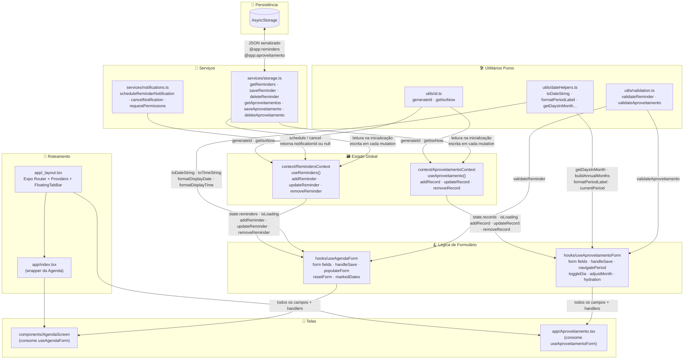
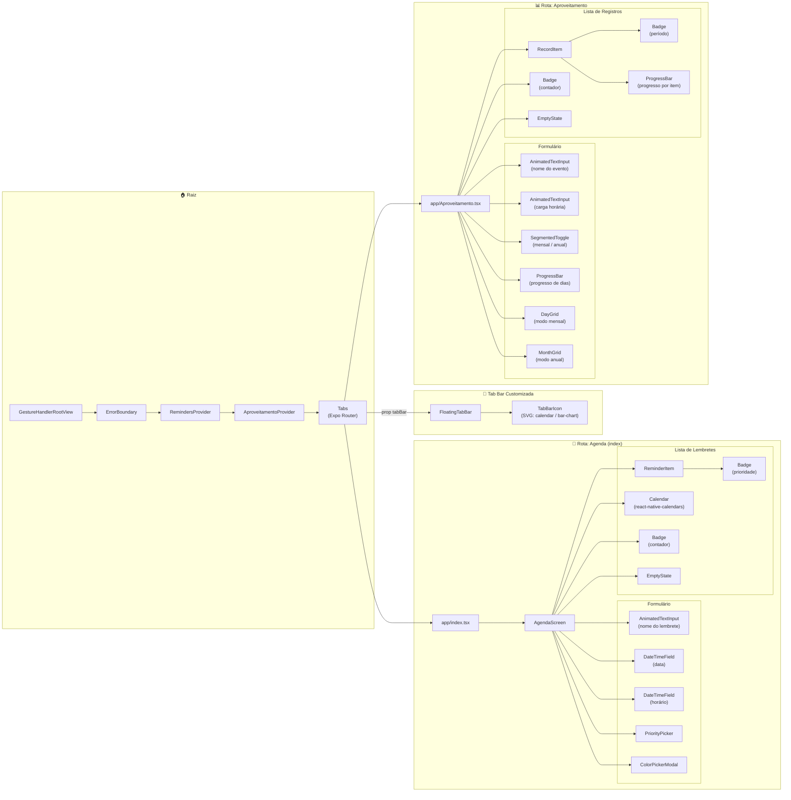
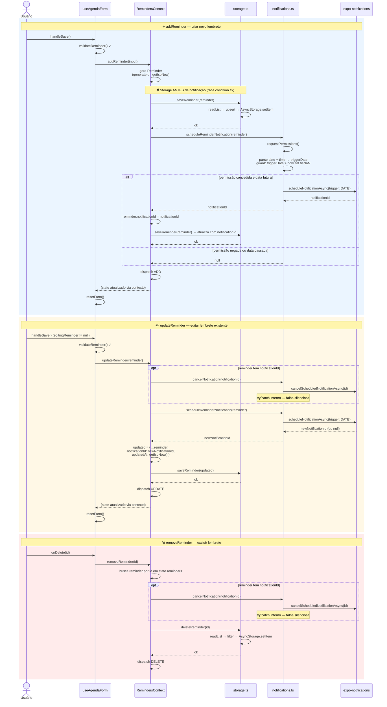
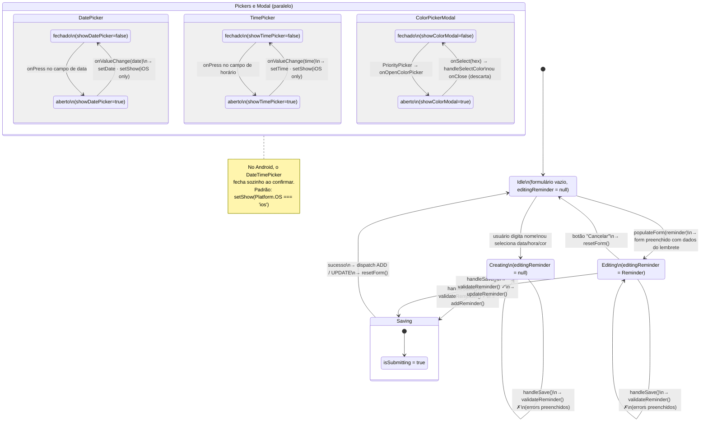
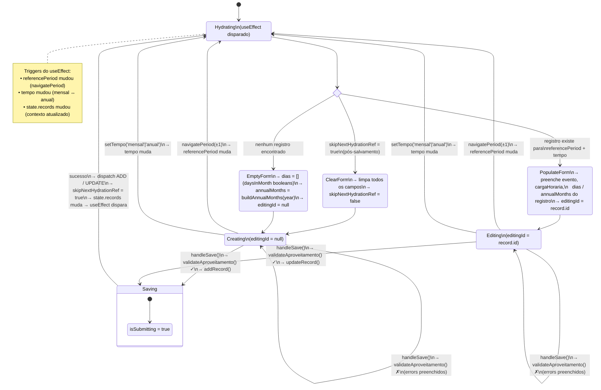
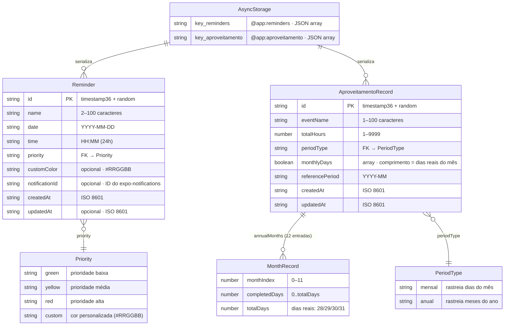

# Arquitetura — Repertório Progressivo

Documentação visual da arquitetura do projeto. Cada diagrama cobre uma camada ou fluxo específico.

---

## 1. Arquitetura de Dados

Fluxo vertical completo de dados: desde a persistência em disco até as telas, passando pelas camadas de serviço, contexto e hooks. As setas indicam a direção do fluxo de dados e chamadas entre módulos.



---

> **Regras de ouro desta arquitetura:**
> - Nenhum componente acessa `AsyncStorage` diretamente — tudo passa por `services/storage.ts`.
> - Nenhum componente usa `useContext(RemindersContext)` diretamente — sempre via `useReminders()` / `useAproveitamento()`.
> - Utilitários em `utils/` são funções puras, sem efeitos colaterais.

---

## 2. Hierarquia de Componentes

Árvore completa de componentes partindo do layout raiz. Mostra a ordem de wrapping dos providers, as duas rotas de navegação e todos os componentes folha utilizados em cada tela.



---

> **Nota de imports dentro de `components/`:**
> Arquivos dentro da pasta `components/` usam imports diretos (`./Foo`) para outros arquivos da mesma pasta.
> O barrel `@/components` é exclusivo para código **fora** de `components/` — violações geram `WARN Require cycle` no Metro.

---

## 3. Fluxo de Notificações

Detalha as três operações que envolvem notificações: criação, atualização e remoção de um lembrete. O fix de race condition está explícito: o `saveReminder` ocorre **antes** do agendamento da notificação, garantindo que o lembrete persiste mesmo que a notificação falhe.



---

> **Garantias do fluxo de notificações:**
> - `scheduleReminderNotification` retorna `null` se: permissão negada, data no passado, data inválida (`isNaN`), ou falha do SO.
> - `cancelNotification` nunca lança exceção para cima — tem `try/catch` interno.
> - Em `updateReminder`, o cancelamento da notificação antiga ocorre **antes** de agendar a nova.
> - `expo-notifications` não é suportado no Expo Go (SDK 53+) — requer `npm run android`.

---

## 4. State Machine — Formulário de Agenda

Máquina de estados do hook `useAgendaForm`. Cobre o ciclo de vida completo do formulário: criação, edição, validação e salvamento. Os estados de sobreposição (pickers e modal de cor) são modelados como regiões paralelas independentes do estado principal.



---

> **Campos do estado do formulário (`useAgendaForm`):**
> `name`, `selectedColor`, `customColor`, `date`, `time`, `showDatePicker`, `showTimePicker`, `showColorModal`, `editingReminder`, `isSubmitting`, `errors`
>
> **Derivados calculados:** `markedDates` — mapa de datas para o componente `Calendar`, recalculado a cada mudança em `state.reminders`.

---

## 5. State Machine — Formulário de Aproveitamento + Hydration

Máquina de estados do hook `useAproveitamentoForm`. O diferencial em relação ao formulário de Agenda é a **lógica de hydration automática**: o formulário não possui botão de edição explícito — ao navegar para um período que já possui registro, o form é preenchido automaticamente. O `skipNextHydrationRef` controla o caso pós-salvamento.



---

> **Por que `skipNextHydrationRef` e não estado React?**
> O ref é mutado de forma síncrona antes do dispatch, garantindo que quando o `useEffect` de hydration for re-executado (causado pelo `state.records` atualizado), o flag já está `true` — sem janela de corrida entre estado e ref.
>
> **Campos do estado (`useAproveitamentoForm`):**
> `evento`, `cargaHoraria`, `tempo`, `referencePeriod`, `dias`, `annualMonths`, `editingId`, `isSubmitting`, `errors`
>
> **Derivados calculados:** `daysInMonth`, `diasMarcados`, `totalHours`, `cargaProgress`, `progressLabel`

---

## 6. Reducers — Ações e Transições de Estado

Os dois reducers exportados para teste compartilham o mesmo conjunto de action types. A distinção está nos **efeitos colaterais** disparados pelos métodos do contexto **antes** do dispatch — o reducer em si é uma função pura. O diagrama mostra as ações, a mutação de estado resultante e os side effects associados.

```mermaid
graph TD
    subgraph RState["Estado — RemindersContext"]
        RS["{ reminders: Reminder[]\n  isLoading: boolean\n  error: string | null }"]
    end

    subgraph AState["Estado — AproveitamentoContext"]
        AS["{ records: AproveitamentoRecord[]\n  isLoading: boolean\n  error: string | null }"]
    end

    subgraph RActions["Ações — RemindersContext"]
        direction TB

        RLS["LOAD_START\n─────────────────\nisLoading = true\nerror = null"]
        RLSu["LOAD_SUCCESS\npayload: Reminder[]\n─────────────────\nreminders = payload\nisLoading = false"]
        RLE["LOAD_ERROR\npayload: string\n─────────────────\nerror = payload\nisLoading = false"]
        RADD["ADD\npayload: Reminder\n─────────────────\nreminders = [...reminders, payload]"]
        RUPD["UPDATE\npayload: Reminder\n─────────────────\nreminders.map(r =>\n  r.id === payload.id\n    ? payload : r)"]
        RDEL["DELETE\npayload: id\n─────────────────\nreminders.filter(r =>\n  r.id !== payload)"]
    end

    subgraph AActions["Ações — AproveitamentoContext"]
        direction TB

        ALS["LOAD_START\n─────────────────\nisLoading = true\nerror = null"]
        ALSu["LOAD_SUCCESS\npayload: AproveitamentoRecord[]\n─────────────────\nrecords = payload\nisLoading = false"]
        ALE["LOAD_ERROR\npayload: string\n─────────────────\nerror = payload\nisLoading = false"]
        AADD["ADD\npayload: AproveitamentoRecord\n─────────────────\nrecords = [...records, payload]"]
        AUPD["UPDATE\npayload: AproveitamentoRecord\n─────────────────\nrecords.map(r =>\n  r.id === payload.id\n    ? payload : r)"]
        ADEL["DELETE\npayload: id\n─────────────────\nrecords.filter(r =>\n  r.id !== payload)"]
    end

    subgraph RSideEffects["Side Effects — só RemindersContext"]
        direction TB

        SE1["addReminder()\n① saveReminder(reminder)\n② scheduleReminderNotification()\n③ dispatch ADD"]
        SE2["updateReminder()\n① cancelNotification(old id)\n② scheduleReminderNotification()\n③ saveReminder(updated)\n④ dispatch UPDATE"]
        SE3["removeReminder()\n① cancelNotification(id)\n② deleteReminder(id)\n③ dispatch DELETE"]
        SE4["init useEffect()\n① dispatch LOAD_START\n② getReminders()\n③ dispatch LOAD_SUCCESS / LOAD_ERROR"]
    end

    subgraph ASideEffects["Side Effects — AproveitamentoContext"]
        direction TB

        SE5["addRecord()\n① saveAproveitamento(record)\n② dispatch ADD"]
        SE6["updateRecord()\n① saveAproveitamento(updated)\n② dispatch UPDATE"]
        SE7["removeRecord()\n① deleteAproveitamento(id)\n② dispatch DELETE"]
        SE8["init useEffect()\n① dispatch LOAD_START\n② getAproveitamentos()\n③ dispatch LOAD_SUCCESS / LOAD_ERROR"]
    end

    %% Side effects disparam as ações
    SE4 -->|"dispatch"| RLS
    SE4 -->|"dispatch"| RLSu
    SE4 -->|"dispatch"| RLE
    SE1 -->|"dispatch"| RADD
    SE2 -->|"dispatch"| RUPD
    SE3 -->|"dispatch"| RDEL

    SE8 -->|"dispatch"| ALS
    SE8 -->|"dispatch"| ALSu
    SE8 -->|"dispatch"| ALE
    SE5 -->|"dispatch"| AADD
    SE6 -->|"dispatch"| AUPD
    SE7 -->|"dispatch"| ADEL

    %% Ações atualizam o estado
    RLS  -->|"atualiza"| RS
    RLSu -->|"atualiza"| RS
    RLE  -->|"atualiza"| RS
    RADD -->|"atualiza"| RS
    RUPD -->|"atualiza"| RS
    RDEL -->|"atualiza"| RS

    ALS  -->|"atualiza"| AS
    ALSu -->|"atualiza"| AS
    ALE  -->|"atualiza"| AS
    AADD -->|"atualiza"| AS
    AUPD -->|"atualiza"| AS
    ADEL -->|"atualiza"| AS
```



---

> **Reducers são funções puras** — não acessam storage nem notifications. Todo efeito colateral ocorre nos métodos do contexto (`addReminder`, `updateRecord`, etc.) antes do `dispatch`.
>
> **Ambos os reducers são exportados** para que os testes de unidade possam exercitá-los diretamente, sem precisar montar providers:
> ```ts
> import { reducer } from '@/context/RemindersContext'
> import { reducer } from '@/context/AproveitamentoContext'
> ```

---

## 7. ER — Tipos de Dados

Entidades do domínio definidas em `types/index.ts` e sua persistência no `AsyncStorage`. Atributos com `?` são opcionais. Os tipos `Priority` e `PeriodType` são union types do TypeScript, representados como entidades de lookup para explicitar os valores válidos.



---

> **Invariantes de dados garantidas em runtime:**
> - `Reminder.date` deve estar no formato `"YYYY-MM-DD"` — chave do `markedDates` do `react-native-calendars`.
> - `Reminder.priority === 'custom'` implica `customColor` presente e válido (`/^#[0-9A-Fa-f]{6}$/`).
> - `AproveitamentoRecord.monthlyDays.length` é sempre igual ao número de dias reais do mês de `referencePeriod`.
> - `MonthRecord.totalDays` reflete o calendário gregoriano real (28/29/30/31) — calculado por `getDaysInMonth()`.
> - `MonthRecord.completedDays` está sempre no intervalo `[0, totalDays]`.
> - Ambas as entidades usam `id` gerado por `generateId()` (`utils/id.ts`) — colisões são praticamente impossíveis.
