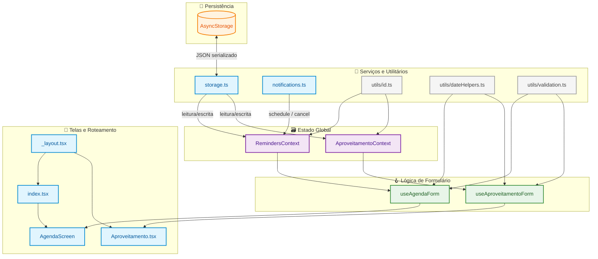
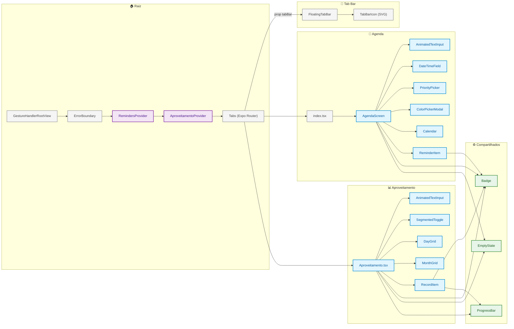
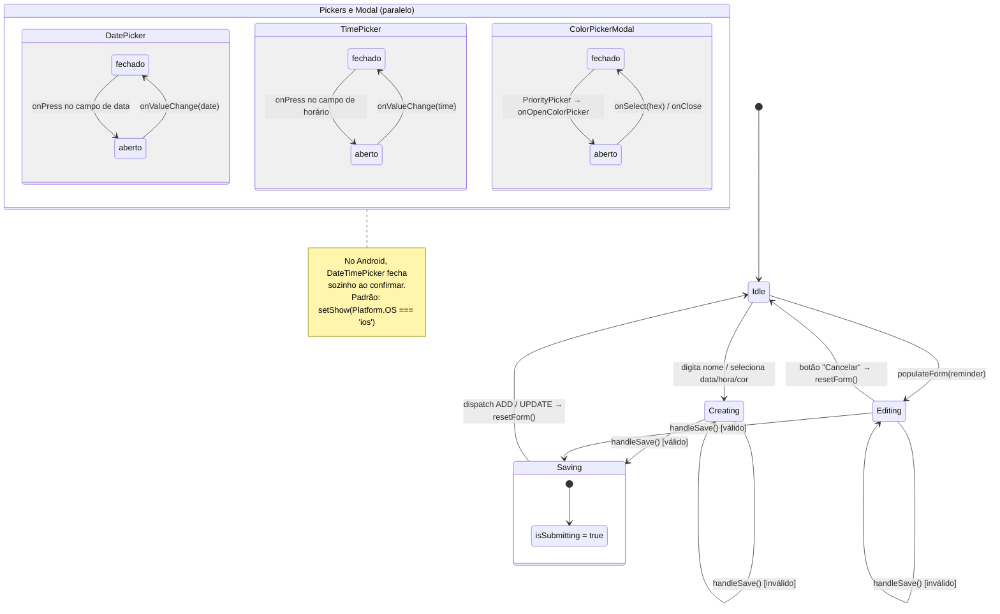
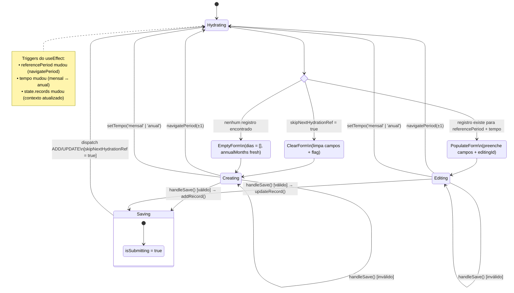
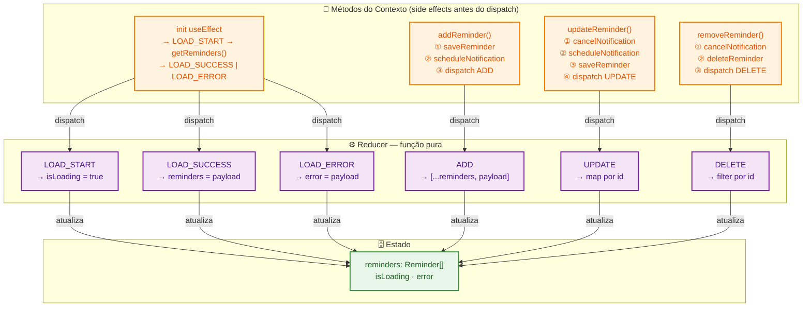
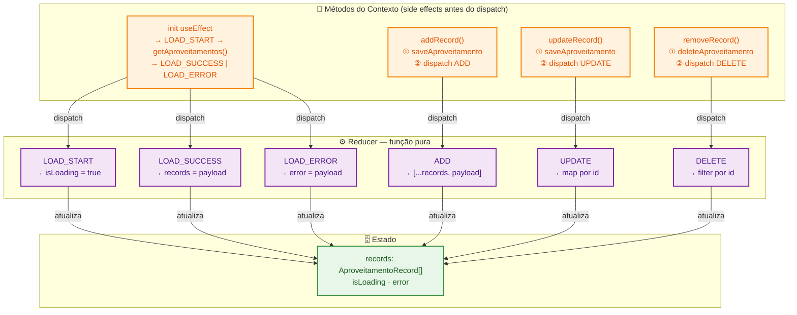
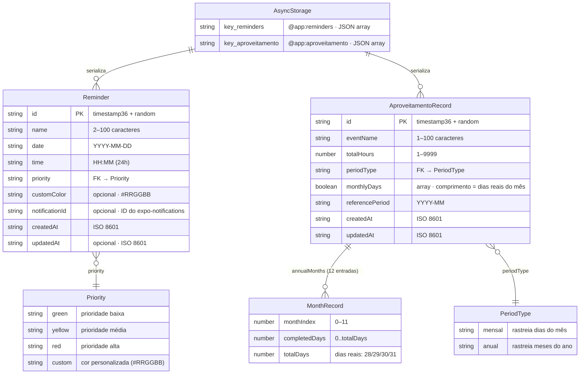

# Arquitetura — Repertório Progressivo

Documentação visual da arquitetura do projeto. Cada diagrama cobre uma camada ou fluxo específico.

**Índice:**
1. [Arquitetura de Dados](#1-arquitetura-de-dados)
2. [Hierarquia de Componentes](#2-hierarquia-de-componentes)
3. [Fluxo de Notificações](#3-fluxo-de-notificações)
4. [State Machine — Agenda](#4-state-machine--formulário-de-agenda)
5. [State Machine — Aproveitamento](#5-state-machine--formulário-de-aproveitamento--hydration)
6a. [RemindersContext — Ações e Side Effects](#6a-reminderscontext--ações-reducer-e-side-effects)
6b. [AproveitamentoContext — Ações e Side Effects](#6b-aproveitamentocontext--ações-reducer-e-side-effects)
7. [ER — Tipos de Dados](#7-er--tipos-de-dados)

---

## 1. Arquitetura de Dados

**Pergunta que responde:** Como os dados fluem desde a persistência em disco até as telas?

**Público-alvo:** Devs que precisam entender quem chama quem e onde adicionar nova lógica.

**Última atualização:** 2026-03-04



**Legenda:**
- 🟠 Laranja: Persistência (AsyncStorage)
- 🔵 Azul: Serviços internos e telas
- ⚫ Cinza: Utilitários puros
- 🟣 Roxo: Estado global (contextos)
- 🟢 Verde: Lógica de formulário (hooks)

**Notas:**
- `storage.ts` exporta: `getReminders`, `saveReminder`, `deleteReminder`, `getAproveitamentos`, `saveAproveitamento`, `deleteAproveitamento`
- `notifications.ts` exporta: `scheduleReminderNotification`, `cancelNotification`, `requestPermissions`
- `dateHelpers.ts` exporta: `toDateString`, `toTimeString`, `formatDisplayDate`, `formatDisplayTime`, `getDaysInMonth`, `buildAnnualMonths`, `formatPeriodLabel`, `currentPeriod`
- Chaves AsyncStorage: `@app:reminders`, `@app:aproveitamento`
- Nenhum componente acessa `AsyncStorage` diretamente — tudo passa por `storage.ts`.
- Nenhum componente usa `useContext` diretamente — sempre via `useReminders()` / `useAproveitamento()`.

---

## 2. Hierarquia de Componentes

**Pergunta que responde:** Qual é a árvore de componentes do layout raiz até as folhas?

**Público-alvo:** Devs frontend que precisam localizar onde um componente está montado ou adicionar um novo.

**Última atualização:** 2026-03-04



**Legenda:**
- 🟣 Roxo: Providers de estado global
- ⚫ Cinza: Navegação e wrappers
- 🔵 Azul: Telas e componentes de rota
- 🟢 Verde: Componentes compartilhados entre rotas

**Notas:**
- A ordem dos providers importa: `GestureHandlerRootView → ErrorBoundary → RemindersProvider → AproveitamentoProvider → Tabs`.
- Arquivos dentro de `components/` usam imports diretos (`./Foo`), nunca o barrel `@/components` — violações geram `WARN Require cycle`.
- `Badge` e `ProgressBar` aparecem em ambas as rotas; `EmptyState` também é compartilhado.

---

## 3. Fluxo de Notificações

**Pergunta que responde:** Em que ordem exata são executadas as operações ao criar, editar ou remover um lembrete com notificação?

**Público-alvo:** Devs que mantêm a lógica de notificações ou investigam bugs de agendamento.

**Última atualização:** 2026-03-04

```mermaid
sequenceDiagram
    actor U as Usuário
    participant H as useAgendaForm
    participant RC as RemindersContext
    participant ST as storage.ts
    participant NT as notifications.ts
    participant OS as expo-notifications

    %% ─── CRIAR LEMBRETE ───────────────────────────────────────────
    rect rgb(235, 245, 255)
        Note over U,OS: ➕ addReminder — criar novo lembrete

        U->>H: handleSave()
        activate H
        H->>H: validateReminder() ✓
        H->>RC: addReminder(input)
        activate RC

        Note over RC,ST: 🔒 Storage ANTES da notificação (race condition fix)
        RC->>ST: saveReminder(reminder)
        activate ST
        ST-->>RC: ok
        deactivate ST

        RC->>NT: scheduleReminderNotification(reminder)
        activate NT
        Note over NT: verifica permissão + valida data/hora

        alt permissão concedida e data futura
            NT->>OS: scheduleNotificationAsync(trigger: DATE)
            OS-->>NT: notificationId
            NT-->>RC: notificationId
            deactivate NT
            RC->>ST: saveReminder(reminder + notificationId)
            activate ST
            ST-->>RC: ok
            deactivate ST
        else permissão negada ou data passada
            NT-->>RC: null
            deactivate NT
        end

        RC->>RC: dispatch ADD
        deactivate RC
        H->>H: resetForm()
        deactivate H
    end

    %% ─── ATUALIZAR LEMBRETE ────────────────────────────────────────
    rect rgb(255, 248, 230)
        Note over U,OS: ✏️ updateReminder — editar lembrete existente

        U->>H: handleSave() [editingReminder != null]
        activate H
        H->>H: validateReminder() ✓
        H->>RC: updateReminder(reminder)
        activate RC

        opt reminder tem notificationId
            RC->>NT: cancelNotification(notificationId)
            NT->>OS: cancelScheduledNotificationAsync(id)
            Note over NT: try/catch interno — falha silenciosa
        end

        RC->>NT: scheduleReminderNotification(reminder)
        NT->>OS: scheduleNotificationAsync(trigger: DATE)
        OS-->>NT: newNotificationId (ou null)
        NT-->>RC: newNotificationId

        RC->>ST: saveReminder(updated + updatedAt)
        activate ST
        ST-->>RC: ok
        deactivate ST

        RC->>RC: dispatch UPDATE
        deactivate RC
        H->>H: resetForm()
        deactivate H
    end

    %% ─── REMOVER LEMBRETE ──────────────────────────────────────────
    rect rgb(255, 235, 235)
        Note over U,OS: 🗑️ removeReminder — excluir lembrete

        U->>H: onDelete(id)
        H->>RC: removeReminder(id)
        activate RC

        opt reminder tem notificationId
            RC->>NT: cancelNotification(notificationId)
            NT->>OS: cancelScheduledNotificationAsync(id)
            Note over NT: try/catch interno — falha silenciosa
        end

        RC->>ST: deleteReminder(id)
        activate ST
        ST-->>RC: ok
        deactivate ST

        RC->>RC: dispatch DELETE
        deactivate RC
    end
```

**Notas:**
- `scheduleReminderNotification` retorna `null` se: permissão negada, data no passado, data inválida (`isNaN`), ou falha do SO.
- `cancelNotification` nunca lança exceção — tem `try/catch` interno.
- Em `updateReminder`, o cancelamento da notificação antiga ocorre **antes** de agendar a nova.
- `expo-notifications` não é suportado no Expo Go (SDK 53+) — requer `npm run android`.

---

## 4. State Machine — Formulário de Agenda

**Pergunta que responde:** Quais são os estados possíveis do formulário de Agenda e o que causa cada transição?

**Público-alvo:** Devs que mantêm `useAgendaForm` ou adicionam novos campos ao formulário.

**Última atualização:** 2026-03-04



**Notas:**
- `Idle`: `editingReminder = null`, formulário vazio.
- `Creating`: `editingReminder = null`, usuário preenchendo campos.
- `Editing`: `editingReminder = Reminder`, campos populados via `populateForm()`.
- Validação inválida mantém o estado atual com `errors` preenchidos — sem transição.
- **Campos do estado:** `name`, `selectedColor`, `customColor`, `date`, `time`, `showDatePicker`, `showTimePicker`, `showColorModal`, `editingReminder`, `isSubmitting`, `errors`
- **Derivados calculados:** `markedDates` — mapa de datas para o `Calendar`, recalculado a cada mudança em `state.reminders`.

---

## 5. State Machine — Formulário de Aproveitamento + Hydration

**Pergunta que responde:** Como o formulário de Aproveitamento carrega automaticamente dados ao navegar entre períodos?

**Público-alvo:** Devs que mantêm `useAproveitamentoForm` ou modificam a lógica de hydration/navegação de período.

**Última atualização:** 2026-03-04



**Notas:**
- **Por que `skipNextHydrationRef` e não estado React?** O ref é mutado de forma síncrona antes do dispatch, garantindo que quando o `useEffect` de hydration for re-executado (causado pelo `state.records` atualizado), o flag já está `true` — sem janela de corrida.
- **Campos do estado:** `evento`, `cargaHoraria`, `tempo`, `referencePeriod`, `dias`, `annualMonths`, `editingId`, `isSubmitting`, `errors`
- **Derivados calculados:** `daysInMonth`, `diasMarcados`, `totalHours`, `cargaProgress`, `progressLabel`

---

## 6a. RemindersContext — Ações, Reducer e Side Effects

**Pergunta que responde:** Como o RemindersContext gerencia estado: quais ações o reducer aceita e quais side effects disparam cada ação?

**Público-alvo:** Devs que adicionam novas operações ao contexto de lembretes ou escrevem testes de unidade do reducer.

**Última atualização:** 2026-03-04



**Legenda:**
- 🟠 Laranja: Métodos do contexto (side effects — acessam storage e notifications)
- 🟣 Roxo: Action types do reducer (função pura)
- 🟢 Verde: Estado resultante

**Notas:**
- O reducer é exportado para testes de unidade: `import { reducer } from '@/context/RemindersContext'`
- Side effects ocorrem nos métodos do contexto **antes** do dispatch — o reducer nunca acessa storage ou notifications.
- Os action types (`LOAD_START`, `LOAD_SUCCESS`, `LOAD_ERROR`, `ADD`, `UPDATE`, `DELETE`) são idênticos ao AproveitamentoContext.

---

## 6b. AproveitamentoContext — Ações, Reducer e Side Effects

**Pergunta que responde:** Como o AproveitamentoContext gerencia estado: quais ações o reducer aceita e quais side effects disparam cada ação?

**Público-alvo:** Devs que adicionam novas operações ao contexto de aproveitamento ou escrevem testes de unidade do reducer.

**Última atualização:** 2026-03-04



**Legenda:**
- 🟠 Laranja: Métodos do contexto (side effects — acessam storage)
- 🟣 Roxo: Action types do reducer (função pura)
- 🟢 Verde: Estado resultante

**Notas:**
- O reducer é exportado para testes de unidade: `import { reducer } from '@/context/AproveitamentoContext'`
- AproveitamentoContext não usa notifications — os side effects de add/update/delete são mais simples (apenas storage + dispatch).
- Action types idênticos ao RemindersContext — a diferença está no shape do payload e nos side effects.

---

## 7. ER — Tipos de Dados

**Pergunta que responde:** Quais são as entidades do domínio, seus atributos e relacionamentos?

**Público-alvo:** Devs que precisam entender a estrutura de dados ou adicionar novos campos.

**Última atualização:** 2026-03-04



**Legenda:**
- Entidades principais: `Reminder`, `AproveitamentoRecord`, `MonthRecord`
- Tipos escalares (union types do TypeScript): `Priority`, `PeriodType`
- Infraestrutura de persistência: `AsyncStorage`

**Notas:**
- `Reminder.date` deve estar no formato `"YYYY-MM-DD"` — chave do `markedDates` do `react-native-calendars`.
- `Reminder.priority === 'custom'` implica `customColor` presente e válido (`/^#[0-9A-Fa-f]{6}$/`).
- `AproveitamentoRecord.monthlyDays.length` é sempre igual ao número de dias reais do mês de `referencePeriod`.
- `MonthRecord.totalDays` reflete o calendário gregoriano real (28/29/30/31) — calculado por `getDaysInMonth()`.
- `MonthRecord.completedDays` está sempre no intervalo `[0, totalDays]`.
